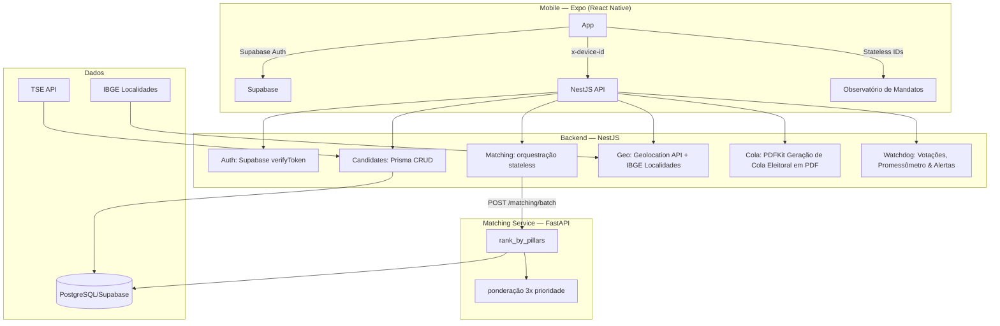

# Documentação Técnica

> **Resumo:** Visão aprofundada da arquitetura da aplicação, incluindo diagramas Mermaid, schemas do banco de dados (Prisma), APIs, e definições do algoritmo de matching e do Observatório de Mandatos pós-eleição.

## Visão geral da aplicação
- **Nome:** Eleições Progressistas
- **Versão:** 2.2.0
- **Arquitetura:** Mobile (Expo React-Native) ↔ Supabase Auth ↔ NestJS API ↔ FastAPI Matching Service ↔ PostgreSQL
- **Principais módulos:** Auth, Priorities Matching, Candidate Management, Geo, ETL, CI/CD, Cola Eleitoral, Watchdog (Observatório de Mandatos), Ads (Anúncios Éticos), Finance (Sustentabilidade PIX), Public-API (Tiered API), Reports (Relatórios B2B)

## Objetivo

Democratizar o acesso à informação política nas Eleições Gerais 2026, conectando eleitores a candidatos de perfil Progressista alinhados aos 13 pilares estruturantes do desenvolvimento nacional, sob o compromisso: **"Cheque o passado. Escolha o futuro."**

A plataforma opera no modelo **Consulta por Prioridades (100% stateless e Coleta Zero)**: o cidadão seleciona até 3 temas de interesse sem informar opiniões políticas, recebendo um ranqueamento de candidatos baseado em dados públicos auditáveis via Portal de Dados Abertos do TSE (`dadosabertos.tse.jus.br`), com memória de cálculo transparente (Votações 40% + Discursos 30% + Posturas 30%), propostas traduzidas em linguagem simples e geração de Cola Eleitoral oficial para impressão em papel.

**Princípios operacionais:**
- **Privacidade Radical**: Zero coleta de opiniões, zero cadastro obrigatório, zero vínculo com CPF/email
- **Transparência Auditável**: Todos os dados provêm de fontes oficiais (TSE, Câmara, Senado) e são verificáveis em tempo real
- **Acessibilidade Universal**: App gratuito, linguagem simples, compatível com dispositivos de entrada e conexão instável
- **Alinhamento ao Interesse Nacional**: Priorização de candidatos comprometidos com soberania, justiça social e desenvolvimento sustentável

## Conteúdo específico

### 1. Arquitetura



### 2. Schema Prisma

```prisma
// ─── Enums ───────────────────────────────────────────

enum UserLevel {
  VOTER
  ANALYST
  ADMIN
}

enum Cargo {
  VEREADOR
  PREFEITO
  VICE_PREFEITO
  DEPUTADO_ESTADUAL
  GOVERNADOR
  VICE_GOVERNADOR
  SENADOR
  DEPUTADO_FEDERAL
  PRESIDENTE
  VICE_PRESIDENTE
}

enum ElectionLevel {
  MUNICIPAL
  ESTADUAL
  FEDERAL
}

enum CandidaturaStatus {
  EM_ANALISE
  DEFERIDO
  INDEFERIDO
  CASSADO
  RENUNCIA
}

enum TranslationStatus {
  PENDING
  TRANSLATED
  FAILED
}

// ─── Models ──────────────────────────────────────────

model User {
  id            String    @id @default(uuid()) @db.Uuid
  email         String    @unique
  passwordHash  String
  cep           String
  municipality  String
  state         String
  level         UserLevel @default(VOTER)
  createdAt     DateTime  @default(now())
  updatedAt     DateTime  @updatedAt

  savedCandidates SavedCandidate[]

  @@map("users")
}

model Candidate {
  id                  String            @id @default(uuid()) @db.Uuid
  tseId               String
  electionYear        Int               @default(2026)
  name                String
  socialName          String?
  viceName            String?
  party               String
  partyNumber         Int
  numeroUrna          String?
  cargo               Cargo
  level               ElectionLevel
  candidaturaStatus   CandidaturaStatus @default(EM_ANALISE)
  dataRegistro        DateTime          @default(now())
  dataJuntaElectoral DateTime?
  municipality        String
  state               String
  cpfHash             String
  photoUrl            String?
  fichaLimpa          Boolean           @default(false)
  financedBy          Json?
  votingHistory       Json?
  proposals           Json?
  governmentPlanUrl   String?
  governmentPlanSummary String?
  profileScores       Json?             // { p1: float, ..., p13: float }
  electionResult      ElectionResult?
  createdAt           DateTime          @default(now())
  updatedAt           DateTime          @updatedAt

  matchResults    MatchResult[]
  savedCandidates SavedCandidate[]
  proposalsRel    Proposal[]
  integrityFlags  IntegrityFlag[]
  candidateVotes  CandidateVote[]
  pledges         Pledge[]

  @@unique([tseId, electionYear])
  @@index([electionYear])
  @@index([candidaturaStatus])
  @@index([municipality, state, cargo])
  @@index([level])
  @@map("candidates")
}

model MatchResult { // legado: sem escrita do /api/matching/rank (stateless)
  id          String   @id @default(uuid()) @db.Uuid
  deviceHash  String   // SHA-256 do dispositivo, NUNCA user_id
  candidateId String   @db.Uuid
  score       Float
  createdAt   DateTime @default(now())

  candidate   Candidate @relation(fields: [candidateId], references: [id])

  @@index([deviceHash])
  @@index([candidateId, score(sort: Desc)])
  @@index([createdAt])
  @@map("match_results")
}

model SavedCandidate {
  id          String   @id @default(uuid()) @db.Uuid
  userId      String   @db.Uuid
  candidateId String   @db.Uuid
  savedAt     DateTime @default(now())

  user        User      @relation(fields: [userId], references: [id])
  candidate   Candidate @relation(fields: [candidateId], references: [id])

  @@unique([userId, candidateId])
  @@map("saved_candidates")
}

model Proposal {
  id                String            @id @default(uuid()) @db.Uuid
  candidateId       String            @db.Uuid
  pillar            String
  title             String
  description       String
  translatedText    String?
  translationStatus TranslationStatus @default(PENDING)
  translationError  String?
  source            String            @default("SEED")
  version           Int               @default(1)
  createdAt         DateTime          @default(now())

  candidate   Candidate @relation(fields: [candidateId], references: [id], onDelete: Cascade)

  @@index([candidateId, pillar])
  @@index([translationStatus])
  @@map("proposals")
}

model IntegrityFlag {
  id          String    @id @default(uuid()) @db.Uuid
  candidateId String    @db.Uuid
  source      String
  flagType    String
  description String
  severity    String
  date        DateTime?
  resolved    Boolean   @default(false)
  referenceUrl String?
  createdAt   DateTime  @default(now())

  candidate   Candidate @relation(fields: [candidateId], references: [id], onDelete: Cascade)

  @@index([candidateId, source])
  @@map("integrity_flags")
}

enum AdvertiserStatus {
  PROPOSTA
  EM_ANALISE
  APROVADO
  RECUSADO
  ATIVO
  ENCERRADO
}

model Advertiser {
  id              String           @id @default(uuid()) @db.Uuid
  name            String
  cnpj            String           @unique
  category        String           // "ONG", "COOPERATIVA", "EMPRESA_SUSTENTAVEL", "SINDICATO", "INSTITUTO", etc.
  pillarAlignment String[]         // ["p3", "p5", "p12"] — pilares alinhados
  status          AdvertiserStatus @default(PROPOSTA)
  contactName     String?
  contactEmail    String?
  applicationNote String?
  isActive        Boolean          @default(true)
  isApproved      Boolean          @default(false) // Requer aprovação manual
  startDate       DateTime         @default(now())
  endDate         DateTime?
  contractValue   Decimal?         // Valor do contrato para transparência
  createdAt       DateTime         @default(now())
  updatedAt       DateTime         @updatedAt
  ads             Ad[]
  
  @@index([isActive, isApproved])
  @@index([status])
  @@map("advertisers")
}

model Ad {
  id            String   @id @default(uuid()) @db.Uuid
  advertiserId  String   @db.Uuid
  format        AdFormat
  title         String
  description   String   @db.Text
  imageUrl      String?
  targetUrl     String
  pillar        String?  // Para PILAR_SPONSOR (ex: "p3")
  screen        String?  // "matching", "search", "matching_result"
  startDate     DateTime?
  endDate       DateTime?
  impressions   Int      @default(0)
  clicks        Int      @default(0)
  isActive      Boolean  @default(true)
  createdAt     DateTime @default(now())
  updatedAt     DateTime @updatedAt
  advertiser    Advertiser @relation(fields: [advertiserId], references: [id], onDelete: Cascade)
  
  @@index([format, isActive, screen])
  @@index([pillar, isActive])
  @@map("ads")
}

enum AdFormat {
  CARD_APOIO      // Final da lista de matching (máx 1 por sessão)
  BANNER          // Topo do feed de busca (80px altura)
  PILAR_SPONSOR   // Contextual na tela de matching (1ª prioridade)
  COLA_FOOTER     // Rodapé do PDF da colinha
}

model AdOptOut {
  id         String   @id @default(uuid()) @db.Uuid
  deviceHash String   @unique // SHA-256 do dispositivo
  optedOutAt DateTime @default(now())
  expiresAt  DateTime // 30 dias depois
  
  @@index([deviceHash])
  @@index([expiresAt])
  @@map("ad_opt_outs")
}

model DonationEvent {
  id          String   @id @default(uuid()) @db.Uuid
  provider    String
  eventId     String   @unique
  amountCents Int
  createdAt   DateTime @default(now())

  @@map("donation_events")
}

enum ApiKeyTier {
  FREE
  PAID
}

model ApiKey {
  id           String     @id @default(uuid()) @db.Uuid
  keyHash      String     @unique          // SHA-256 da chave; chave plena só na criação
  tier         ApiKeyTier @default(FREE)
  contactEmail String?                     // uso: gestão da chave/abuso; nunca exposto publicamente
  purpose      String?                     // declaração de uso (pesquisa, jornalismo...)
  dailyLimit   Int        @default(1000)   // FREE 1000 | PAID 10000
  usageCount   Int        @default(0)
  usageResetAt DateTime   @default(now())
  isActive     Boolean    @default(true)
  expiresAt    DateTime?                   // PAID: renovação mensal; FREE: null
  createdAt    DateTime   @default(now())

  @@index([tier, isActive])
  @@map("api_keys")
}

enum ElectionResult {
  ELEITO
  NAO_ELEITO
  SUPLENTE
}

enum VoteChoice {
  SIM
  NAO
  ABSTENCAO
  AUSENTE
}

enum PledgeStatus {
  PROPOSTA
  EM_ANDAMENTO
  CUMPRIDA
  QUEBRADA
}

model LegislativeVote {
  id             String          @id @default(uuid()) @db.Uuid
  house          String          // "CAMARA" | "SENADO"
  externalId     String          @unique
  date           DateTime
  description    String
  summaryUrl     String          // link oficial da votação (auditabilidade)
  pillarMapping  Json?           // ["p3","p9"]
  mappedBy       String?         // "LLM" | "ADMIN"
  createdAt      DateTime        @default(now())
  candidateVotes CandidateVote[]

  @@index([date])
  @@map("legislative_votes")
}

model CandidateVote {
  id          String          @id @default(uuid()) @db.Uuid
  candidateId String          @db.Uuid
  voteId      String          @db.Uuid
  choice      VoteChoice

  candidate   Candidate       @relation(fields: [candidateId], references: [id], onDelete: Cascade)
  vote        LegislativeVote @relation(fields: [voteId], references: [id], onDelete: Cascade)

  @@unique([candidateId, voteId])
  @@index([voteId])
  @@map("candidate_votes")
}

model Pledge {
  id          String       @id @default(uuid()) @db.Uuid
  candidateId String       @db.Uuid
  text        String
  pillar      String
  status      PledgeStatus @default(PROPOSTA)
  evidenceUrl String?
  updatedAt   DateTime     @updatedAt
  createdAt   DateTime     @default(now())

  candidate   Candidate    @relation(fields: [candidateId], references: [id], onDelete: Cascade)

  @@index([candidateId, status])
  @@map("pledges")
}

enum ReportOrderStatus {
  SOLICITADO
  PAGO
  ENTREGUE
  CANCELADO
}

model ReportProduct {
  id            String        @id @default(uuid()) @db.Uuid
  slug          String        @unique
  title         String
  description   String        @db.Text
  category      String        // "PRIORIDADES", "COMPROMETIMENTO", "PROMESSAS", "FINANCIAMENTO"
  priceCents    Int
  publicSummary String        @db.Text // teaser público, só agregados
  createdAt     DateTime      @default(now())
  orders        ReportOrder[]

  @@map("report_products")
}

model ReportOrder {
  id          String            @id @default(uuid()) @db.Uuid
  productId   String            @db.Uuid
  buyerOrg    String
  buyerEmail  String            // contato B2B; finalidade: entrega e nota; nunca exposto
  status      ReportOrderStatus @default(SOLICITADO)
  paymentRef  String?           // id da transação PIX confirmada offline
  deliveredAt DateTime?
  createdAt   DateTime          @default(now())
  product     ReportProduct     @relation(fields: [productId], references: [id])

  @@index([status])
  @@map("report_orders")
}

model AggregateCounter {
  id        String   @id @default(uuid()) @db.Uuid
  key       String   @unique // ex: "rank:p3:SP:2026-09-08" — SEM identificadores de dispositivo/sessão
  count     Int      @default(0)
  updatedAt DateTime @updatedAt

  @@map("aggregate_counters")
}
```

### 3. API Endpoints

#### Auth
| Método | Endpoint | Auth | Body/Query | Response |
|--------|----------|------|------|----------|
| POST | `/api/auth/sync` | Supabase JWT | `{ id, email, location: { uf, municipality, ibge_code } }` | `User` |
| GET | `/api/auth/me` | Supabase JWT | — | `{ supabase, local }` |
| POST | `/api/auth/dev-login` | Não (Dev Mode) | `{ email }` | `{ access_token, user }` |

#### Matching e Consulta por Prioridades (Privacy-First & Stateless)
| Método | Endpoint | Auth | Headers | Body | Response |
|--------|----------|------|---------|------|----------|
| POST | `/api/matching/rank` | Não | — | `RankMatchDto` | `{ results: CandidateMatchItem[], computedAt }` |
| POST | `/api/matching/compute` | Não | — | `RankMatchDto` (alias compatível) | `{ results: CandidateMatchItem[], computedAt }` |

> **Nota de Privacidade:** Matching 100% stateless — nenhuma persistência de preferências ou opiniões dos cidadãos no banco de dados. A tabela `match_results` não armazena registros desta consulta.

```typescript
RankMatchDto {
  priority_pillars?: ['p2', 'p7', 'p13']  // até 3 pilares prioritários (opcional)
  location?: { uf: 'SP', ibge_code: '3550308' }
  includePending?: boolean
}
```

#### Candidates & Auditoria TSE
| Método | Endpoint | Auth | Query/Params | Response |
|--------|----------|------|-------|----------|
| GET | `/api/candidates` | Não | `state, municipality?, cargo?, party?, search?` | `Candidate[]` (respeita circunscrição: nacional para PRESIDENTE, estadual para GOV/SEN/DEP FED/DEP EST) |
| GET | `/api/candidates/tse/dados-abertos-search` | Não | `q, cargo?, uf?` | Resultados auditáveis consultados no Portal de Dados Abertos do TSE (`dadosabertos.tse.jus.br`) |
| GET | `/api/candidates/tse/live` | Não | `uf, municipio` | `Candidate[]` em análise ao vivo |
| GET | `/api/candidates/tse/source-info` | Não | — | Metadados e confiabilidade das fontes oficiais |
| GET | `/api/candidates/cargos/:level` | Não | `level` | `Cargo[]` aplicáveis ao nível |
| GET | `/api/candidates/:id` | Não | `id` | `Candidate` |
| GET | `/api/candidates/:id/raio-x` | Não | `id` | `RaioXData` (inclui ficha limpa, doações, votações e memória de cálculo `justificativa` + gap analysis para cada pilar) |

#### Proposals
| Método | Endpoint | Auth | Body/Query | Response |
|--------|----------|------|------|----------|
| POST | `/api/proposals/translate-batch` | Admin | `{ candidateId }` | Tradução de propostas via LLM |
| GET | `/api/proposals/translation-stats` | Admin | — | Estatísticas de tradução |

#### Geo
| Método | Endpoint | Auth | Params | Response |
|--------|----------|------|----------|----------|
| GET | `/api/geo/cep/:cep` | Não | `cep` | `{ municipality, state, eligibleCargos[] }` |

#### Cola Eleitoral (PDF & Impressão)
| Método | Endpoint | Auth | Params/Query | Response |
|--------|----------|------|--------------|----------|
| GET | `/api/cola/pdf` | Não | `ids, state, municipality` | PDF stream (`application/pdf`) formatado para impressão no dia da votação, fotos, caixas de dígitos de urna e ordem oficial do TSE |
| GET | `/api/cola/pdf/download` | Não | `ids, state, municipality` | Download com header `Content-Disposition: attachment; filename="cola-eleitoral-2026.pdf"` |
| POST | `/api/cola/pdf` | Não | `{ candidates: [...], state, municipality }` | PDF stream a partir de lista arbitrária de candidatos estruturados |

#### Observatório de Mandatos (Pós-Eleição & 100% Stateless)
| Método | Endpoint | Auth | Params/Query/Body | Response |
|--------|----------|------|-------------------|----------|
| GET | `/api/watchdog/votes` | Não | `candidateId, since?` | Histórico de votações nominais do candidato |
| GET | `/api/watchdog/alerts` | Não | `candidateIds, priorities?` | Alertas de divergência calculados em memória (stateless, zero logs) |
| GET | `/api/watchdog/pledges` | Não | `candidateId?` | Promessas de campanha cadastradas e status no Promessômetro |
| GET | `/api/watchdog/dashboard` | Não | — | Agregados e métricas consolidadas (TTL cache: 10 min) |
| POST | `/api/watchdog/admin/vote-mapping` | Admin (`x-admin-secret`) | `{ voteId, pillarId }` | Mapeamento manual com proteção de overwrite (`mappedBy: "ADMIN"`) |
| PATCH | `/api/watchdog/admin/pledges/:id/status` | Admin (`x-admin-secret`) | `{ status, evidenceUrl? }` | Atualização de status da promessa com URL de evidência |
| PATCH | `/api/watchdog/admin/candidates/:id/result` | Admin (`x-admin-secret`) | `{ electionResult }` | Atualização do resultado pós-eleitoral do candidato |

#### Relatórios B2B & Telemetria Agregada (Coleta Zero)
| Método | Endpoint | Auth | Params/Query/Body | Response |
|--------|----------|------|-------------------|----------|
| GET | `/api/reports/products` | Não | — | Catálogo de relatórios analíticos disponíveis |
| GET | `/api/reports/products/:slug` | Não | `slug` | Detalhes do relatório e teaser com agregados públicos |
| POST | `/api/reports/orders` | Não | `{ productSlug, buyerOrg, buyerEmail }` | Criação de pedido com instruções de pagamento PIX manual |
| GET | `/api/reports/orders/:id` | Não | `id` | Status do pedido e confirmação de pagamento |
| GET | `/api/reports/download/:orderId` | Não (Pedido Pago) | `orderId, format? (json, csv, pdf)` | Download do relatório completo no formato desejado |
| GET | `/api/reports/admin/orders` | Admin (`x-admin-secret`) | — | Listagem de pedidos corporativos recebidos |
| PATCH | `/api/reports/admin/orders/:id/confirm` | Admin (`x-admin-secret`) | `{ paymentRef }` | Conciliação manual de pagamento PIX e liberação |
| PATCH | `/api/reports/admin/orders/:id/deliver` | Admin (`x-admin-secret`) | — | Marcação formal de entrega |

#### Health
| Método | Endpoint | Response |
|--------|----------|----------|
| GET | `/api/health` | `{ status, database, timestamp }` |

### 4. Algoritmo de Matching (rank_by_pillars)

```python
# services/matching/app/algorithms.py

PRIORITY_MULTIPLIER = 3.0
DEFAULT_WEIGHT = 1.0

def rank_by_pillars(candidate, priority_pillars):
    """
    Matching stateless e privacy-first: sem coleta de opiniões.
    """
    for p in PILLARS:
        focus = candidate.get_focus(p)  # 0.0 a 1.0 (ou 0.5 se ausente, is_estimated = True)
        weight = 3.0 if p in priority_pillars else 1.0

    score = Σ(focus × weight) / Σ(weights) × 100
    score += 5 if candidate.ficha_limpa else 0  # cap 100
    return score, reason, is_estimated, priority_aligned
```

#### Regras
| Regra | Valor |
|---|---|
| Peso pilar prioritário | 3.0x |
| Peso pilar não-prioritário | 1.0x |
| Bônus ficha limpa | +5 (cap 100) |
| pillar_focus ausente | assume 0.5 + `is_estimated: true` |
| Threshold "tema prioritário destacado" | focus ≥ 0.7 |

### 5. ETL Pipeline

```bash
cd services/etl
cp .env.example .env  # DATABASE_URL, TSE URLs
npm install
npm run start
```

| Job | Fonte | Frequência |
|-----|-------|------------|
| sync_candidates_tse | TSE DivulgaCandContas | Anual |
| sync_finance | TSE DivulgaCandContas | Mensal (campanha) |
| sync_integrity_ceis | CEIS/Tesouro | Mensal |
| sync_watchdog_votes | Dados Abertos Câmara / Senado | Diário (02:00 AM) |
| compute_matching | Interno | Sob demanda |

### 6. Infra
| Serviço | Tecnologia | Escopo |
|---------|-----------|--------|
| API | NestJS + Prisma | Backend REST |
| Matching | Python FastAPI (porta 8002 → 8001 no container) | Cálculo de matching |
| DB | PostgreSQL (Docker local ou Supabase) | Dados + Auth + RLS |
| ETL | Node.js + Prisma | Ingestão TSE |
| Mobile | Expo React Native | App iOS/Android |
| CI/CD | GitHub Actions | lint → test → build → deploy |

### 7. Problemas Conhecidos (Troubleshooting)

#### 7.1 Web: "Objects are not valid as a React child" / "Invalid hook call"
**Sintoma:** ao rodar `npx expo start --web`, a tela quebra com erro React.
**Causa:** duplicata de React no `node_modules` (`react-native-web` x `expo`).
**Correção (já aplicada):** o `package.json` raiz fixa uma única versão via `overrides`:
```json
"overrides": {
  "react": "18.3.1",
  "react-dom": "18.3.1"
}
```
**Verificação:**
```bash
npm ls react   # deve aparecer apenas react@18.3.1 (deduped)
```

### 8. Blindagem de Segurança e Resiliência (Defense-in-Depth)

A versão 2.2.0 introduz uma camada completa de blindagem cibernética sem comprometer a performance ou a experiência do usuário:

#### 8.1 Rate Limiting Inteligente (`@nestjs/throttler`)
Configurado no `AppModule` com armazenamento em memória (`ThrottlerStorageService`):
- **Global:** 120 req / 60s
- **Geração de PDF (`/api/cola/pdf`):** 15 req / 60s (previne consumo excessivo de CPU pelo PDFKit)
- **Dev Login (`/api/auth/dev-login`):** 10 req / 60s (bloqueio de ataques de força bruta)
- **Matching (`/api/matching/rank`):** 60 req / 60s
- **Métricas de Anúncios e Opt-Out (`/api/ads/*`):** 30 req / 60s
- **Webhook PIX (`/api/finance/pix/webhook`):** 30 req / 60s

#### 8.2 Tratamento Global de Exceções (`GlobalHttpExceptionFilter`)
Registrado em `main.ts` via `app.useGlobalFilters(new GlobalHttpExceptionFilter())`:
- Intercepta todas as exceções HTTP e erros não tratados da API.
- Retorna exclusivamente respostas padronizadas RFC:
  ```json
  {
    "statusCode": 404,
    "timestamp": "2026-09-07T22:00:00.000Z",
    "path": "/api/candidates/invalid-id",
    "message": "Candidato não encontrado"
  }
  ```
- **Proteção:** Jamais expõe stack traces, nomes de arquivos, queries SQL ou dados internos do Prisma/PostgreSQL.

#### 8.3 Cabeçalhos de Segurança HTTP (`helmet`)
- Strict-Transport-Security (HSTS): 1 ano com `includeSubDomains` e `preload`.
- Content-Security-Policy (CSP) estrito para recursos locais.
- X-Frame-Options: `SAMEORIGIN` (anti-clickjacking).
- X-Content-Type-Options: `nosniff`.
- Remoção do header `X-Powered-By` (`app.disable('x-powered-by')`).

#### 8.4 Limitação de Payloads HTTP DoS
- O corpo das requisições Express é restrito a **512 KB** (`express.json({ limit: '512kb' })` e `express.urlencoded({ limit: '512kb' })`), mitigando ataques de exaustão de memória e ReDoS.

#### 8.5 Proteção contra Ataques de Temporização (`crypto.timingSafeEqual`)
- No processamento do webhook financeiro (`POST /api/finance/pix/webhook`), a assinatura HMAC é validada utilizando `crypto.timingSafeEqual` com buffers de comprimento idêntico, prevenindo que invasores deduzam o segredo por análise de tempo de resposta.

#### 8.6 Proteção de Endpoints Administrativos
- O endpoint `/api/system/reset-memory` requer autenticação obrigatória via cabeçalho `x-admin-secret` ou parâmetro validado contra a variável de ambiente `ADMIN_SECRET`.

#### 8.7 Circunscrição Eleitoral & UI de Seleção de Cargos
- **Busca de Candidatos:** Query Prisma otimizada com `take: 2000` na busca por estado para assegurar que candidatos à Presidência da República (circunscrição nacional) apareçam em todas as UFs sem corte alfabético.
- **Barra de Cargos com Rolagem Lateral:** Implementação no cliente com botões flutuantes (`‹` e `›`), listener de roda do mouse (`wheel`) e suporte a touch swipe, garantindo que "Deputado Estadual" e demais cargos fiquem sempre plenamente visíveis e operáveis.

### 9. Módulos de Monetização Ética, Sustentabilidade e Transparência

#### 9.1 Rede de Anúncios Éticos (`AdsModule` — `/api/ads`)
- **Princípio:** Financiamento transparente sem rastreamento de dados de eleitores, sem cookies e sem compartilhamento com ad-techs.
- **Onboarding Self-Service (`POST /api/ads/apply`):** Permite propostas diretas de anunciantes alinhados aos 13 pilares progressistas (cooperativas, editoras, ONGs, energia limpa).
- **Fila de Moderação e Auditoria:**
  - `GET /api/ads/admin/applications` — Fila de propostas em análise (requer `x-admin-secret`).
  - `PATCH /api/ads/admin/advertisers/:id/review` — Análise técnica e parecer de conformidade ética.
  - `PATCH /api/ads/admin/advertisers/:id/contract` — Registro de dados contratuais e valor negociado.
  - `PATCH /api/ads/admin/advertisers/:id/approve` — Homologação final e liberação de veiculação.
- **Regras Eleitorais:** Blackout total durante o período eleitoral oficial (16/08 a 05/10), com ativação comercial estritamente nos períodos permitidos.
- **Transparência Pública (`GET /api/ads/transparency`):** Relação aberta de patrocinadores, valores arrecadados e conformidade aos pilares cívicos.

#### 9.2 Sustentabilidade Cívica e Doações PIX (`FinanceModule` — `/api/finance`)
- **Infraestrutura Zero Prejuízo:** Monitoramento dos custos de hospedagem, infraestrutura e DNS com contadores públicos.
- **Recebimento Direto via PIX (`POST /api/finance/pix/webhook`):** Processamento sem gateways intermediários de pagamento, com autenticação HMAC SHA-256 e proteção `crypto.timingSafeEqual`.
- **Transparência Contábil (`GET /api/finance/transparency`):** Relação entre custos reais de servidores e valores arrecadados, garantindo prestação de contas à comunidade.

#### 9.3 API Pública Tiered (`PublicApiModule` — `/api/public`, `/api/public/v1`)
- **Acesso Programático:** Fornece dados públicos eleitorais consolidados para jornalistas, pesquisadores, ONGs e universidades.
- **Gestão de Chaves HMAC (`/api/public/keys`):**
  - Geração de chaves públicas com hash SHA-256 armazenado no banco (`ApiKey`). A chave plena em texto limpo só é exibida no momento da criação.
  - Tiers de Acesso:
    - `FREE`: 1.000 requisições/dia (auto-atendimento para cidadãos e projetos abertos).
    - `RESEARCH`: 10.000 requisições/dia (projetos acadêmicos e cobertura jornalística independente).
    - `PRO`: 50.000 requisições/dia (institutos de pesquisa e organizações de monitoramento cívico).
- **Rotas Versionadas (`/api/public/v1/*`):**
  - `/api/public/v1/pillars` — Catálogo dos 13 pilares e diretrizes programáticas.
  - `/api/public/v1/candidates` — Busca e filtragem de candidatos com ficha limpa e propostas.
  - `/api/public/v1/stats/aggregate` — Estatísticas agregadas sem identificadores de eleitores.
  - `/api/public/v1/exports/candidates.csv` — Exportação em massa em formato tabular aberto.

#### 9.4 Observatório de Mandatos (`WatchdogModule` — `/api/watchdog`)
- **Monitoramento Pós-Eleitoral:** Acompanhamento contínuo da atuação parlamentar dos candidatos eleitos na Câmara dos Deputados e no Senado Federal.
- **Votações Nominais e Promessômetro:**
  - `GET /api/watchdog/votes` — Histórico de votações nominais de matérias de interesse público com alinhamento aos 13 pilares.
  - `GET /api/watchdog/pledges` — Acompanhamento de promessas de campanha (Proposta, Em Andamento, Cumprida, Quebrada).
  - `GET /api/watchdog/alerts` — Alertas de votações contrárias às diretrizes iluministas e salvaguardas socioambientais.
  - `GET /api/watchdog/dashboard` — Painel consolidado com taxa de fidelidade partidária e cumprimento de metas.
- **Soberania do Eleitor:** A consulta lê apenas a lista de candidatos favoritados localmente no dispositivo (LocalStorage/SecureStore), mantendo Coleta Zero no servidor.

#### 9.5 Relatórios Cívicos B2B (`ReportsModule` — `/api/reports`)
- **Catálogo de Inteligência Pública:** Relatórios técnicos e estudos temáticos sobre tendências eleitorais, comprometimento programático e financiamento partidário.
- **Rotas e Entregas:**
  - `GET /api/reports/catalog` — Catálogo público de produtos e teasers de relatórios.
  - `POST /api/reports/orders` — Criação de pedidos com geração de chave PIX de liquidação manual.
  - `GET /api/reports/download/:orderId` — Download seguro de pacotes nos formatos JSON, CSV e PDF com assinatura digital de integridade (`REPORT_DELIVERY_SIGNING_KEY`).
- **Garantia de Coleta Zero:** Todos os relatórios operam exclusivamente sobre dados agregados de candidaturas e telemetria de contadores globais, sem jamais coletar, armazenar ou expor dados pessoais de eleitores.

#### 9.6 Gestão de Ciclo de Vida e Sunset Clause (`OpsModeModule` / `OpsModeService`)
- **Modos de Operação Dinâmicos:**
  - `full`: Operação eleitoral completa durante a campanha (matching, busca, cola, anúncios éticos e relatórios).
  - `watchdog`: Modo pós-eleitoral focado no Observatório de Mandatos, fiscalização de promessas e votações nominais.
  - `archive`: Modo estático de baixo custo para preservação histórica, desligando jobs pesados de background.
- **Cláusula de Pôr do Sol (Sunset Clause):** Transição automática programada para modo `archive` em caso de déficit operacional acumulado após o 2º turno (26/10/2026), garantindo a premissa de Zero Prejuízo aos mantenedores.
- **Endpoints de Auditoria:**
  - `GET /api/ops/mode` — Consulta pública do modo operacional corrente.
  - `PATCH /api/ops/mode` — Alteração administrativa segura (requer `x-admin-secret`).

#### 9.7 Rotas Mobile e Telas Cívicas (Expo Router)
- `/transparencia` (`transparencia.tsx`): Painel público com livro-caixa aberto, demonstrativo contábil, custos de servidores e arrecadação de doações.
- `/observatorio` (`observatorio.tsx`): Interface do Observatório de Mandatos com acompanhamento de votações e promessômetro pós-eleição.
- `/relatorios` (`relatorios.tsx`): Catálogo cívico B2B com visualização de produtos e solicitação via PIX manual.
- `/anuncie` (`anuncie.tsx`): Formulário de submissão self-service para anunciantes éticos e negócios de impacto.
- `/media-kit` (`media-kit.tsx`): Especificações de formatos, tabela de preços, regras de conformidade e política de blackout eleitoral.
- `/api-publico` (`api-publico.tsx`): Portal de emissão imediata e documentação de chaves da API Pública Tiered.
- `/apoie` (`apoie.tsx`): Canal de apoio financeiro direto via chave PIX manual com prestação de contas instantânea.
- `/manual` (`manual.tsx`): Manual do Usuário interativo contendo a definição iluminista de progressismo, guia da urna, critérios de exclusão e FAQ.

#### 9.8 Mecanismo de Busca "Pergunte à Proposta de Mandato" (`apps/mobile/utils/civic-search.ts`)
- **Arquitetura de Custo Zero (Prejuízo Zero & Coleta Zero):**
  - Motor de busca semântica executado 100% no cliente (JavaScript/TypeScript in-memory).
  - R$ 0,00 de infraestrutura e zero chamadas a APIs pagas de LLM por requisição.
  - As perguntas dos eleitores nunca saem do dispositivo, preservando total conformidade com a LGPD e privacidade radical.
- **Algoritmo de Matching Semântico:**
  - **Dicionário de Expansão Cívica (`CIVIC_SYNONYMS`):** Mapeamento bidirecional de vocabulário popular para termos legislativos oficiais (ex: "creche" -> "educação infantil", "esgoto/água" -> "saneamento básico", "tarifa" -> "transporte público", "imposto" -> "justiça fiscal/tributação").
  - **Ponderação Estruturada de Relevância (Score 0 a 100):**
    * Título da Proposta e Pilar: Peso 3.0x
    * Diretriz Prioritária: Peso 2.0x
    * Metas e Ações Práticas: Peso 2.0x
    * Diagnóstico Geral: Peso 1.0x
  - **Highlight Contextual:** Identificação do snippet mais relevante (~120 caracteres) e renderização visual com realce de fundo suave nos textos do card expandido.


